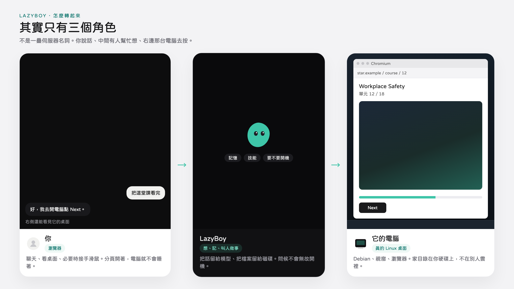
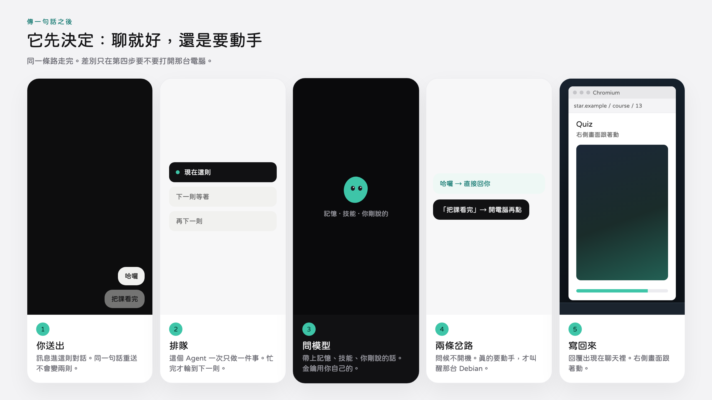
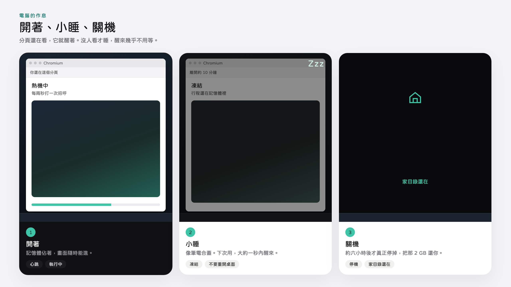
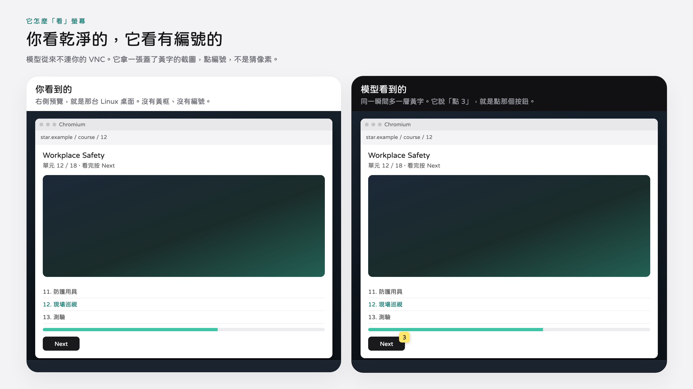
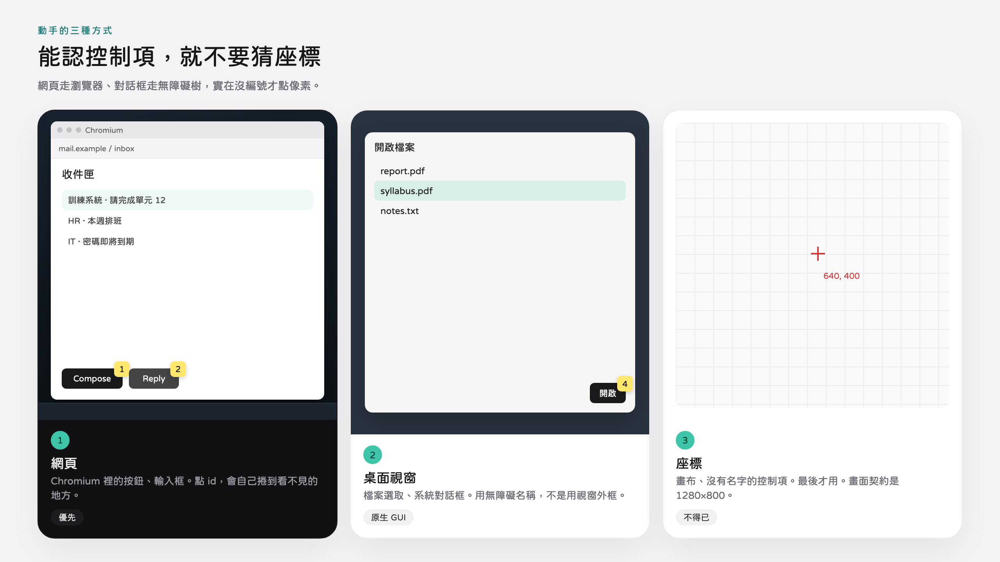
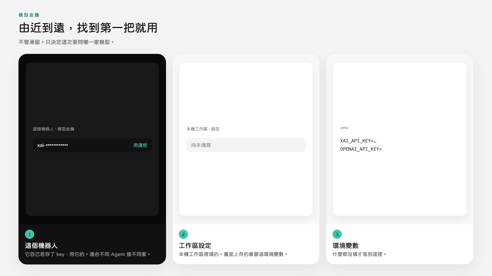
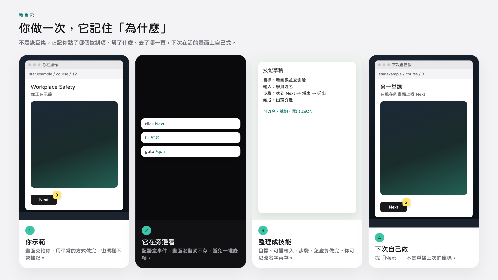
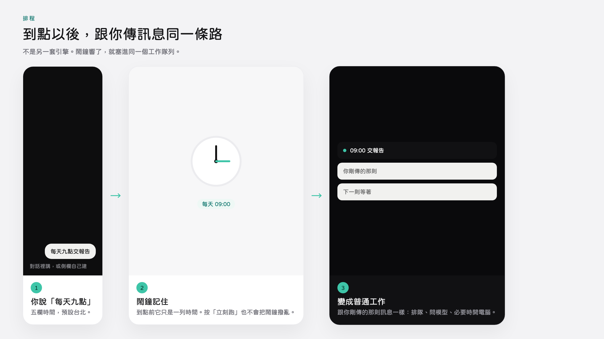
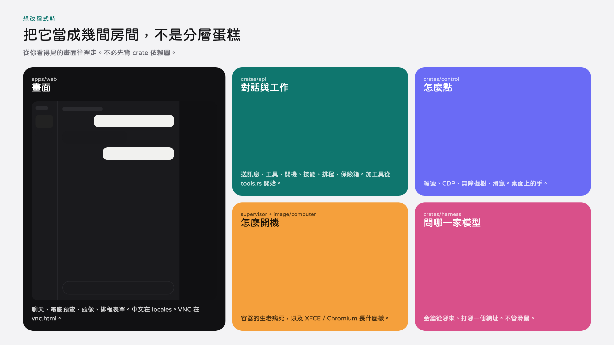

# LazyBoy


在瀏覽器裡開 Agent。每個都有自己的 Linux 桌面：開網頁、敲指令、學你示範過的流程。金鑰、模型、檔案都留在你這台機器上。

---

## 需要的硬體

LazyBoy 是本機系統，不是雲端沙盒。機器要跑四件事：**Postgres**、**API（含網頁）**、**supervisor**、以及每個 Agent 的 **Debian 桌面容器**。

| 項目 | 最低能跑 | 建議（一台桌面常開） |
| --- | --- | --- |
| 作業系統 | macOS / Linux，已裝 Docker Engine + Compose | 同上，磁碟給 Docker 至少 30 GB |
| CPU | 4 核 | 8 核以上。每個桌面預設吃 2 核（`LAZYBOY_COMPUTER_CPUS`） |
| 記憶體 | 8 GB（只能開一台、還會卡） | **16 GB**。每個桌面預設 2 GB（`LAZYBOY_COMPUTER_MEMORY_MB`）再加上 API、Postgres、嵌入模型 |
| 磁碟 | 約 15 GB（桌面映像 + Postgres） | 家目錄 `data/homes/` 會隨瀏覽器設定檔長大 |
| GPU | 不需要 | 模型走網路 API，畫面是 CPU 上的 Xvfb |
| 網路 | 第一次建映像、拉套件需要 | 之後離線也能開 UI；聊天要模型金鑰能連外 |

預設一個 Team 電腦容器可同時掛最多 **8** 個螢幕（`TEAM_SCREEN_LIMIT`）。再開私人電腦就是再一個容器、再 2 GB。分頁開著時心跳會讓桌面保持熱機；關掉分頁約 10 分鐘後凍結（記憶體還在），約 6 小時後才真正停機。

---

## 怎麼快速啟動

要有 Docker（含 Compose 外掛）和 Make。第一次會編 `lazyboy/computer:local`（Debian + XFCE + Chromium），會比較久。

```bash
make env
# 在 .env 填 XAI_API_KEY
# （也可以之後在「本機工作區 → 設定」接 xAI / OpenCode Go / OpenAI 相容端點）
make up
make health
```

打開 [http://127.0.0.1:3101](http://127.0.0.1:3101)，用 `.env` 裡的 `LAZYBOY_APP_TOKEN` 登入，建一個 Agent，傳一句話。

沒有 Make：

```bash
cp .env.example .env
# openssl rand -hex 32  → LAZYBOY_APP_TOKEN
# openssl rand -hex 32  → SANDBOX_SUPERVISOR_TOKEN
# openssl rand -hex 32  → LAZYBOY_VAULT_KEY
docker compose up -d --build
```

前端熱重載：`apps/web` 裡 `npm install && npm run dev`，開 [http://127.0.0.1:5173](http://127.0.0.1:5173)。Vite 把 `/api` 和 `/view` 轉到 3101。

本機 Rust 開發（Postgres 仍在 Docker）：

```bash
make dev              # 準備 .env、Postgres、桌面映像
make dev-supervisor   # 終端 1
make dev-api          # 終端 2
```

| 指令 | 做什麼 |
| --- | --- |
| `make up` / `make down` / `make purge` | 啟動／停止（留資料）／連 Postgres 一起清 |
| `make logs` `make ps` `make health` | 看狀態 |
| `make computer` | 只重建桌面映像 |
| `make postgres` | 只開資料庫 `127.0.0.1:5434` |

---

## 跟 Grok Bot 比，好在哪

[Grok Bot](https://grok.com) 是 xAI 的雲端隊友：對話、電腦、排程都在他們的機器上。LazyBoy 走同一類產品（本機開源實作對齊 Rakazo 那條線），差在**誰擁有執行環境**。

| | Grok Bot | LazyBoy |
| --- | --- | --- |
| 跑在哪 | xAI 雲端 | 你的 Docker |
| 模型 | Grok | 你帶金鑰：xAI、OpenCode Go、或任何 OpenAI 相容端點 |
| 電腦 | 廠商提供的桌面 | 你映像裡的 Debian／XFCE／Chromium，家目錄在 `data/homes/` |
| 資料 | 在服務端 | 對話、記憶、保險箱、瀏覽器設定檔都在本機 Postgres + 磁碟 |
| 登入帳號 | 跟雲端工作流程走 | 每個 Agent 自己的保險箱（AES-256-GCM），模型只看到帳號 id |
| 客製 | 封閉 | 開源。工具、MCP、技能 JSON 可改可搬 |
| 費用形態 | 訂閱／用量 | 電費與硬體；模型金鑰另計 |
| 多 Agent 同桌 | 產品內建 | Team 電腦一個容器最多 8 螢幕；私人電腦一人一容器 |
| 教會它 | 看產品當下提供什麼 | 你示範一次，CDP 記語意事件，模型整理成技能 |

適合 LazyBoy 的情況：資料不能出門、要自己選模型、要看它點了哪個控制項、或想把「看完訓練影片交測驗」這種流程做成可匯出的技能。

Grok Bot 適合的情況：不想養 Docker、要官方託管、機器不夠力。

---

## 每個功能簡介

**對話與 Session**  
每個 Agent 多則對話。訊息進 Postgres，同一則用 `clientNonce` 去重。問候、閒聊走純文字，**不會**為了「看一下螢幕」去開 Docker。

**Team / 私人電腦**  
Team：工作區共用一個家目錄，每個 bot 有自己的 `DISPLAY`（`:1`、`:2`…）和瀏覽器設定檔。私人：這個 bot 獨佔一個容器。

**即時畫面**  
右側預覽是 noVNC。瀏覽器連 `/view/{botId}/vnc.html`，API 用已登入的 cookie 轉到容器裡的 websockify。模型看到的截圖另走 `computer_observe`，上面會蓋黃字編號；你盯著的 VNC **沒有**那些編號。

**接管 / 釋放**  
人按接管就拿到控制租約（預設 15 分鐘，心跳續約）。進行中的 run 會進 `waiting_takeover`，放開後從目前畫面接著做。模型遇到登入牆、2FA、驗證碼會呼叫 `request_takeover`。

**觀察與操作**  
- Chromium 網頁：`browser`（CDP，點 element id）  
- 原生視窗（對話框、檔案管理員、XFCE）：`computer_act`（AT-SPI id，不行再退 xdotool 座標）  
- 檔案與指令：`list_files` / `read_file` / `write_file` / `shell`  
點到 `[disabled]` 的控制項會最多等 45 秒等它亮。模型用文字回「我在等」會結束整段 run，所以等待必須是 `wait` 工具。

**教技能**  
你示範，容器內 CDP 錄「點了哪個控制項、填了什麼、去了哪一頁」，再抽幾個關鍵畫面。停下來後模型整理成意圖級 playbook，之後用普通工具在**當下畫面**找控制項，不是重播座標。密碼欄不錄。技能可匯出 JSON。

**記憶**  
`pgvector` + MiniLM（384 維）。只有你叫它記住、或它呼叫 `remember` 的內容會進長期記憶。密碼與 token 會被拒。清除對話不會清記憶。

**保險箱**  
每個 bot 自己的站名／帳號／密碼。模型用 `list_accounts` 只看到站與使用者名稱，`use_saved_login` 在 Chromium 登入表單填入。金鑰用 `LAZYBOY_VAULT_KEY` 加密。

**排程**  
五欄 cron，預設 `Asia/Taipei`。對話裡講「以後每天九點」或側欄新增。tick 迴圈把到期列變成普通 queued run。

**MCP**  
工作區級外掛。市集或自訂 stdio／HTTP／SSE。stdio 跑在 API 容器裡。

**群組**  
多個 Agent 同一個 thread。Team 電腦上各用各的螢幕。同一 bot 同時只跑一個 run，後面的訊息排隊。

**附件**  
圖片給當則模型看，不進歷史二進位。要讓電腦開原檔會放 `inbox/`，兩小時後刪。

**頭像與狀態**  
Blobatar 色塊＋眼睛。啟動、喚醒、連線、換手時，預覽左上角與思考列會顯示對應文字。分頁開著時心跳保住容器，換手不拆 VNC。

---

## 系統怎麼轉起來



Compose 裡 supervisor **不**對主機開埠。API 在容器網路連 `supervisor:7091`。家目錄 `data/homes/<homeKey>` bind 進容器的 `/home/lazyboy`。

---

## 你送一則訊息



同一 bot 已有進行中的工作時，新訊息會排隊（`queuedBehindActive`）。人正在接管時，後面的話只排隊，思考轉圈不會假裝它還在動。問候路徑會把工具表清空，從源頭避免「哈囉」去開電腦。

`execute_run` 每一輪：續租約 → 寫步驟文字 → 問模型 → 沒有工具就結束（技能沒過會再把畫面塞回去）→ 有工具且需要沙盒才 boot → 畫面沒變就不重複塞圖。回合上限：聊天 4、一般 40、技能 80。

---

## 電腦的作息



閒置（`crates/api/src/computer.rs` `idle_loop`）：

1. 執行中、超過 10 分鐘沒人看、也沒有進行中的 run／示範 → `docker pause`，狀態 `suspended`
2. 休眠超過 6 小時 → `docker stop`，狀態 `stopped`
3. 分頁還在就心跳，不會進 1

開機／喚醒：已在跑就直接回；凍結中就 `unpause`（約一秒）；沒有容器才 `provision`，等 `/tmp/lazyboy/ready`。畫面走 `/view/{bot}/vnc.html`，已登入的 cookie 轉到 websockify。

---

## 它怎麼看、怎麼點





模型從不直接連 VNC。它只打 API 工具；工具經 sandbox HTTP 進 supervisor，再 `docker exec` 或打容器內 `controld`。

編號只畫在給模型的 JPEG 上。VNC 是乾淨桌面。每次 navigation／snapshot 會重編號，舊 id 作廢。`computer_act` 點在瀏覽器視窗上會被拒，避免用像素點網頁。解析度契約是 **1280×800**。

每個 bot 一個 `computer_screens` 列：slot、DISPLAY、執行租約、控制租約。人接管寫 `control_holder=user`，worker 在回合邊界停，不跟你搶滑鼠。`view_only` 用 postMessage 切，不重掛 iframe，所以換手時預覽不會黑掉。

`lazyboy-controld` 聽 `127.0.0.1:7070`。Team 多螢幕：slot 0 = `:1`，slot N = `:N+1`。`lazyboy-screen ensure` 在同一個容器裡再長一組 Xvfb。

---

## 模型金鑰從哪來



`crates/harness` 不管滑鼠，只決定這次 run 要用哪一家模型。真正的 agent 迴圈在 `crates/api/src/runs.rs`。

金鑰：**這個機器人 → 工作區設定 → 環境變數**。API 跑在 Docker 時，迴圈位址 `127.0.0.1` 會被改成 `host.docker.internal`，才能打到你本機的相容端點。

---

## 教會它



之後 run 若 prompt 對得上技能名，會把完整 playbook 塞進當則，並清掉舊聊天以免模型複誦上次的「還在倒數」。執行仍用 `browser`／`computer_act`，在**現在**的畫面上找「Next」，不是記像素。

---

## 排程怎麼進工作



Cron 五欄。時區寫在列上，預設台北。`立刻跑` 只是立刻插一筆 run，不改下一拍時間。

---

## 專案目錄（二次開發從這裡找）



Cargo workspace。畫面在 `apps/web`，對話與工作在 `api`，怎麼點在 `control`，開機在 `supervisor` + `image/computer`，問哪一家模型在 `harness`。前端是獨立的 Vite app，由 API 把 `apps/web/dist`（或開發時的 `apps/web`）端出去。

```text
LazyBoy/
├── apps/web/                 瀏覽器 UI（Vite + React）
│   ├── src/App.tsx           幾乎全部畫面：側欄、聊天、電腦、設定
│   ├── src/schedule.tsx      排程面板
│   ├── src/avatar.tsx        Blobatar 頭像
│   ├── src/api.ts            fetch 包裝、401
│   ├── src/types.ts          跟 API JSON 對齊的型別
│   ├── src/locales/zh-TW.ts  所有使用者看得到的字
│   ├── src/*.css             樣式（styles / chat / computer / refinements…）
│   └── vnc.html              內嵌桌面（noVNC）；API 的 /view 會讀這一檔
├── crates/
│   ├── contracts/            跨 crate 的型別：Bot、Run、ComputerState、動作 JSON
│   ├── harness/              模型後端：CredentialChain、resolve_backend、connect_model
│   ├── control/              桌面契約：螢幕 slot、租約、CDP/AT-SPI/xdotool、overlay
│   │                         含 a11y.py / cdp.py（容器裡被 exec 的腳本）
│   ├── sandbox/              API 打 supervisor 的 HTTP 客戶端；fake 給測試
│   ├── supervisor/           Docker：provision / pause / unpause / exec / observe / act
│   ├── controld/             打進容器的小 HTTP（127.0.0.1:7070）
│   └── api/                  唯一對外程序：路由、worker、idle、排程 tick、靜態網頁
│       └── src/
│           ├── main.rs       啟動、三條背景迴圈
│           ├── routes.rs     組 router；bot / computer HTTP 也在這
│           ├── runs.rs       agent 迴圈（租約、complete_once、nudge）
│           ├── tools.rs      tool_definitions + dispatch（加工具從這裡）
│           ├── computer.rs   boot / 凍結 / 心跳 / 螢幕租約
│           ├── sessions.rs   對話 CRUD、送訊息、SSE
│           ├── skills.rs     示範錄製與蒸馏
│           ├── schedules.rs  cron
│           ├── vault.rs      登入保險箱
│           ├── memory.rs     pgvector 記憶
│           ├── mcp.rs        MCP 連線
│           ├── screen_proxy.rs  /view 反代
│           └── db.rs         SQL 與列定義
├── image/
│   ├── api/Dockerfile
│   ├── supervisor/Dockerfile
│   └── computer/             桌面映像
│       ├── Dockerfile
│       ├── start.sh          PID 1：controld + Xvfb/XFCE/VNC
│       └── lazyboy-screen    Team 額外 DISPLAY
├── migrations/               sqlx，檔名流水號；API 啟動時自動 migrate
├── data/homes/               每個電腦的家目錄（bind 進容器 /home/lazyboy）
├── tests/                    跨語言的小測試（node:test、Python）
├── scripts/                  init-env、build-computer-image、dev
├── docker-compose.yml        正式堆疊（Postgres + supervisor + API）
├── Makefile                  make up / dev / test
└── reference/rakazo/         上游參考實作，不要當 runtime 依賴
```

### 想改什麼，開哪個檔

| 你要做的事 | 先開 |
| --- | --- |
| 加一個模型工具（例如 `screenshot_region`） | `crates/api/src/tools.rs`（`tool_definitions` + `dispatch`）；若要 GUI，`runs.rs` 的 `tool_needs_sandbox` / `tool_needs_gui` |
| 工具對應的滑鼠／鍵盤／CDP | `crates/control/src/{actions,x11,cdp,a11y}.rs` 與同目錄 `.py` |
| 新的 HTTP 端點 | 功能模組自己的 `router()`（如 `schedules.rs`），在 `routes.rs` `.merge(...)`；電腦／bot 則直接寫在 `routes.rs` |
| 新狀態、動作 JSON、Run 狀態機 | `crates/contracts/src/`（改完 `api` / 前端 `types.ts` 一起對） |
| 換模型供應商或金鑰解析 | `crates/harness/src/resolve.rs`、`crates/contracts/src/model.rs`、`workspace.rs` |
| 容器怎麼開、凍結、等 ready | `crates/supervisor/src/docker.rs`、`crates/api/src/computer.rs` |
| 桌面裡多裝套件、改 XFCE、開機腳本 | `image/computer/`，然後 `make computer` |
| 對話 UI、電腦預覽、頭像小卡 | `apps/web/src/App.tsx` + 對應 css |
| 畫面上的中文 | `apps/web/src/locales/zh-TW.ts`（key 加了 `tsc` 才會過） |
| 內嵌 VNC 行為（貼上、唯讀） | `apps/web/vnc.html` |
| 新資料表 | `migrations/0xx_....sql`；列定義補 `crates/api/src/db.rs` |
| 排程 UI | `apps/web/src/schedule.tsx` |
| MCP 市集清單 | `crates/api/src/mcp_catalog.rs` |

### 加一支工具的最短路徑

1. `tools.rs` 的 `tool_definitions` 加 `ToolDefinition`（名稱、說明、JSON Schema）。說明是寫給模型看的。  
2. 同一個檔的 `dispatch` 加 match arm，回 `ToolOutcome { text, image, pause, blocks }`。  
3. 若會動到桌面：`runs.rs` 裡 `tool_needs_sandbox` / `tool_needs_gui` 把名字加進去，否則不會 boot、也拿不到螢幕租約。  
4. 需要新的容器指令就放 `control`（Rust 組 argv，Python 做 CDP/AT-SPI），supervisor 的 `exec` 已經會把 `DISPLAY` 帶進去。  
5. 前端若要顯示步驟文字，`runs.rs` 的 `describe_step` 加一列。  
6. `SANDBOX_PROVIDER=fake cargo test -p lazyboy-api` 先過，再對真容器看。

### 本機二次開發迴圈

```bash
make env && make postgres          # 資料庫
make computer                      # 桌面映像有改才需要
make dev-supervisor                # 終端 1，:7091
make dev-api                       # 終端 2，:3101，會自動跑 migrations
# 前端另開：
cd apps/web && npm install && npm run dev    # :5173
```

- 改 `apps/web/src`：Vite 熱更新。  
- 改 `crates/api`：停掉 `dev-api` 再 `make dev-api`。  
- 改 `crates/supervisor`：同樣重跑 supervisor。  
- 改 `crates/control` 的 `.py`：映像沒重建的話，執行中的容器還是舊腳本；要嘛 `make computer` 後重開電腦，要嘛確認 supervisor exec 讀的是映像內檔案。  
- 改 `image/computer`：一定 `make computer`，再在 UI 重啟該台電腦。  
- 契約改了：同時改 `contracts`、呼叫端、`apps/web/src/types.ts`。

檢查：

```bash
make fmt && make clippy && make test
node --test tests/frontend.test.mjs          # 排程 cron、VNC 貼上、登入填表防護
```

`SANDBOX_PROVIDER=fake` 時 API 不碰 Docker，適合先測 run／工具契約。

`reference/rakazo/` 是對齊用的上游，不要在 LazyBoy runtime import 它。

---

## 安全（操作時要記得）

- Supervisor 只在 Compose 內網，不要對 LAN 開埠  
- 畫面走已登入 API，VNC 密碼不進瀏覽器 URL  
- 區網請走 HTTPS；終端是 HTTPS 時設 `LAZYBOY_SECURE_COOKIE=true`  
- API 綁非本機時 `LAZYBOY_APP_TOKEN` 至少 32 字；supervisor 拒絕空白、過短、`dev-token`  
- 保險箱用 `LAZYBOY_VAULT_KEY`；換登入 token 時這把 key 要留著  
- 模型看不到密碼本文；2FA／CAPTCHA 一定要人在**它的**畫面上處理
