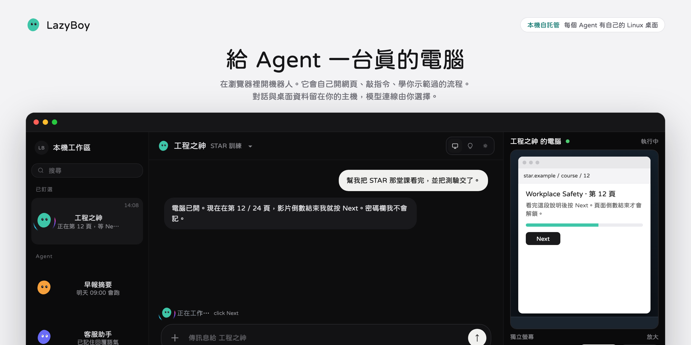

<div align="center">


**English** · [繁體中文](./README.zh-TW.md)

# LazyBoy

**Give AI a computer so it can do the work.**

A self-hosted AI agent workspace. Assign tasks in text or voice, watch the desktop live, and take over whenever you need to.

[Quick start](#quick-start) · [Features](#features) · [Architecture](./docs/architecture.md) · [Operations](./docs/operations.md) · [Development](./docs/development.md)

</div>



LazyBoy gives each agent its own Linux desktop in Docker — browser, terminal, and files. You can run several agents, put them in a group, turn a demonstration into a skill, and schedule it to run again.

This is an early `0.1.0` release with desktop and phone browser UIs. You bring your own model API key.

## Features

- **A lasting workspace**: each agent has its own chats, run history, and optional long-term memory.
- **A real computer**: open pages, use the terminal, organize files, drive the GUI — and watch it live.
- **Take over any time**: sign in, pass a check, or nudge things by hand on the same desktop, then hand it back.
- **Several agents and groups**: shared Team computers or private dedicated desktops.
- **Teach by demo, then schedule**: turn a walkthrough into a skill; use cron for repeat work.
- **Your models and tools**: xAI, OpenCode Go, OpenAI-compatible endpoints, MCP, and file skills.
- **Voice calls**: after you enable a voice provider, you can talk to the agent on a call.
- **Phone-friendly**: collapse the chat sidebar; the remote desktop has keyboard, trackpad, right-click, drag, and scroll.
- **English and Traditional Chinese**: switch the UI language in the app.

## Quick start

You need Docker and Compose, Git, Make, Python 3, and an API key for a supported model. On macOS use Docker Desktop or OrbStack; on Linux use Docker Engine.

From the repo root:

```bash
make env
```

Edit the generated `.env` and set one of `XAI_API_KEY`, `OPENCODE_GO_API_KEY`, or `OPENAI_API_KEY`. The init tool creates the login and service secrets; running it again keeps existing values.

```bash
make up
make health
```

Open **[http://127.0.0.1:3101](http://127.0.0.1:3101)**, sign in with `LAZYBOY_APP_TOKEN` from `.env`, create an agent, and pick a model.

The first run builds the API and Linux desktop images from source and takes a while. The build toolchain lives in the containers, so a full Docker deploy does not need Rust or Node.js on the host.

Try a concrete task:

> Open the site I name, summarize the page, and save the notes as a Markdown file in the workspace.

Status and logs:

```bash
make ps
make logs
make down  # stop services, keep PostgreSQL data
```

For resource limits, environment variables, HTTPS, and in-container sudo, see [Operations](./docs/operations.md).

## On a phone

Desktop and phone share the same web UI. After you deploy on a host the phone can reach, open that URL in the phone browser. `127.0.0.1` is the phone itself — it will not reach another machine.

Tap outside the chat sidebar to collapse it. On the remote desktop you can switch between tap-to-click and trackpad, and use the toolbar for keyboard, right-click, or drag. Put the service behind HTTPS before you expose it; see [Operations](./docs/operations.md#安全模型).

## Stack

- **Frontend**: React 19, TypeScript, Vite, noVNC
- **Backend**: Rust 2024, Axum, Tokio
- **Data**: PostgreSQL, pgvector, SQLx
- **Desktop**: Docker, Debian, XFCE, Chromium, Xvfb
- **Computer control**: CDP, AT-SPI, X11
- **Extensions**: MCP, file skills, demonstration playbooks

Flow diagrams, handoff, component roles, and the computer lifecycle live in **[Architecture](./docs/architecture.md)**. The older **[interactive diagram](./docs/workflow.html)** is still there — download it and open it in a browser.

## Local development

Besides Docker, you need a Rust toolchain that supports the 2024 edition, plus Node.js / npm.

```bash
make dev
make dev-supervisor  # terminal 1
make dev-api         # terminal 2
```

Frontend hot reload in another terminal:

```bash
cd apps/web
npm install
npm run dev
```

Open [http://127.0.0.1:5173](http://127.0.0.1:5173). Tests and the tree layout are in the [development guide](./docs/development.md).

## Docs

The guides below are currently in Traditional Chinese.

| Doc | Contents |
| --- | --- |
| [Architecture](./docs/architecture.md) | Task flow, system architecture, computer lifecycle |
| [Interactive diagram](./docs/workflow.html) | Zoomable, searchable HTML chart; download and open |
| [Operations](./docs/operations.md) | Resources, env vars, security, site checks, sudo |
| [Agent experience](./docs/agent-experience.md) | Turn limits, persistent terminal, live chat |
| [hermes-agent review](./docs/hermes-agent-cua-review.md) | Cua harness smoothness: comparison with hermes-agent |
| [Development](./docs/development.md) | Local dev, checks and tests, directory layout |
| [Env example](./.env.example) | Environment variables and defaults |

## Data

Chats, memory, browser profiles, and encrypted credentials stay on your host. When you use an external model, the prompts, tool results, and screenshots the task needs may still be sent to that provider.

---

<div align="center">

**Daniel Wang** 

[igs170911@gmail.com](mailto:igs170911@gmail.com)

<a href="https://www.buymeacoffee.com/daniel.wang.1993"></a>

[Apache License 2.0](./LICENSE)

</div>
