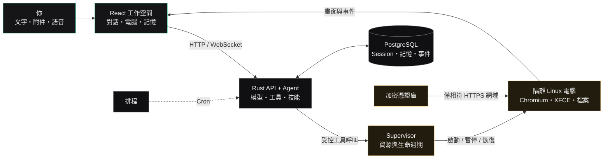
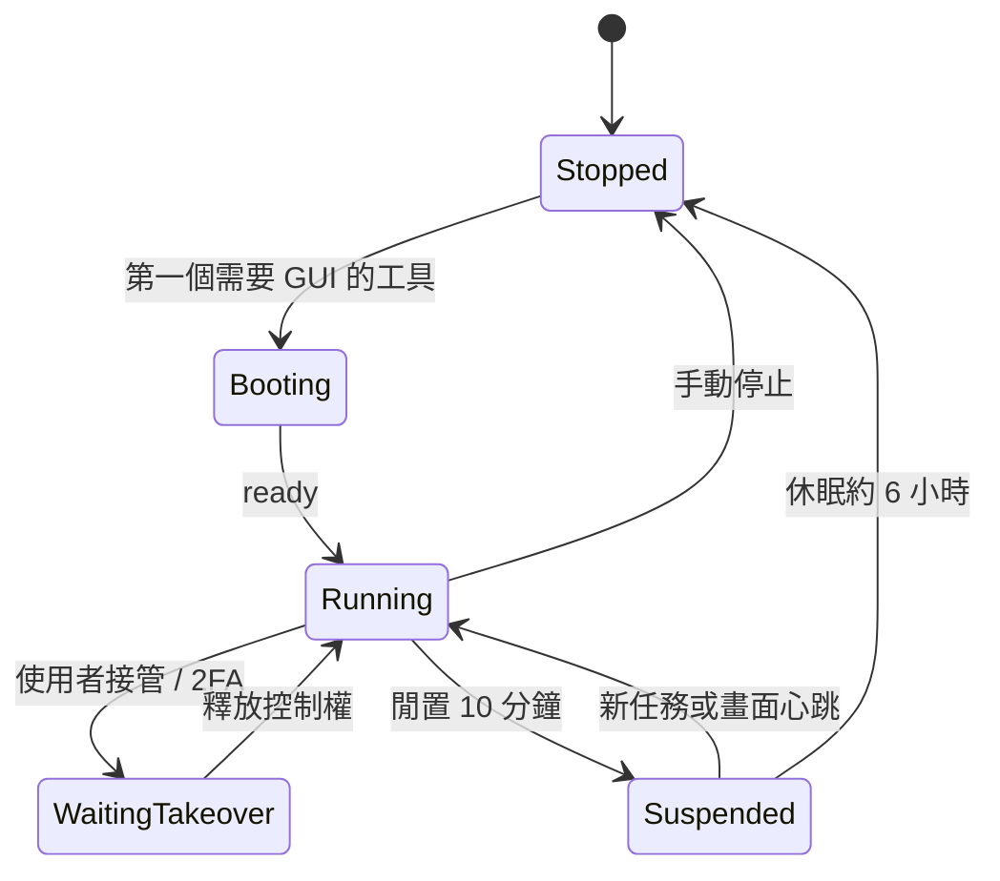

<div align="center">

# LazyBoy

### 給 Agent 一台真的電腦

在瀏覽器裡指派工作，讓 AI Agent 在隔離的 Linux 桌面中開網頁、操作應用程式、整理檔案，並在你需要時把控制權交回來。

[](#快速開始)
[](./Cargo.toml)
[](./apps/web/package.json)
[](./docker-compose.yml)

[快速開始](#快速開始) · [功能](#核心能力) · [運作流程](#一個任務如何完成) · [系統架構](#系統架構) · [二次開發](#二次開發) · [安全](#安全模型)

</div>


LazyBoy 是一套本機優先（local-first）的多 Agent 工作空間。每個 Agent 都能使用瀏覽器、終端、檔案系統與桌面應用程式；執行畫面可即時觀看、可以人工接管，也能把示範整理成技能，之後透過排程重複執行。

> [!IMPORTANT]
> LazyBoy 會把對話、記憶、憑證與瀏覽器設定檔持久化在自己的主機，但使用外部模型時，完成任務所需的提示詞、工具結果或畫面仍可能傳送給你設定的模型供應商。請依資料敏感度選擇供應商與部署方式。

## 為什麼是 LazyBoy？

| 一般聊天機器人 | LazyBoy |
| --- | --- |
| 告訴你怎麼做 | 在隔離桌面中實際操作 |
| 看不到執行過程 | 即時 noVNC 畫面與步驟狀態 |
| 人與 Agent 搶控制權 | 接管／釋放租約，安全交接 |
| 每次重新說明流程 | 示範一次，儲存為可攜技能 |
| 一次性對話 | Session、長期記憶、排程與群組 |
| 固定模型與工具 | xAI、OpenCode Go、OpenAI 相容端點與 MCP |

## 快速開始

### 需求

- macOS 或 Linux
- Docker Engine / Docker Desktop（含 Compose）
- Make、Git
- 至少 4 核 CPU、8 GB RAM；建議 8 核、16 GB RAM
- 一組支援的模型 API 金鑰

第一次啟動會建置 Debian、XFCE、Chromium 桌面映像，因此會比後續啟動久。

```bash
git clone <your-repository-url>
cd LazyBoy

make env
# 編輯 .env，至少填入 XAI_API_KEY、OPENCODE_GO_API_KEY
# 或 OPENAI_API_KEY 其中之一

make up
make health
```

開啟 [http://127.0.0.1:3101](http://127.0.0.1:3101)，使用 `.env` 中的 `LAZYBOY_APP_TOKEN` 登入，建立第一個 Agent，然後直接描述目標。

```text
打開指定的訓練網站，完成還沒看完的章節，最後整理進度。
```

常用指令：

| 指令 | 用途 |
| --- | --- |
| `make up` | 建置並啟動完整堆疊 |
| `make health` | 檢查 API 健康狀態 |
| `make logs` | 持續查看服務日誌 |
| `make ps` | 查看容器狀態 |
| `make down` | 停止服務，保留 PostgreSQL 資料 |
| `make purge` | 停止服務並刪除 PostgreSQL volume |

沒有 Make 時，可以從 `.env.example` 建立設定後執行：

```bash
cp .env.example .env
# 為 LAZYBOY_APP_TOKEN、SANDBOX_SUPERVISOR_TOKEN、
# LAZYBOY_VAULT_KEY 各自執行一次 openssl rand -hex 32
docker compose up -d --build
```

## 核心能力

| 能力 | 實際行為 |
| --- | --- |
| 可觀察的電腦操作 | 右側 noVNC 顯示 Agent 的 1280×800 桌面；模型觀察與人類畫面分流 |
| 瀏覽器與原生桌面控制 | 網頁透過 CDP 元素操作；原生 UI 使用 AT-SPI，必要時才退回座標 |
| 人工接管 | 登入、2FA、驗證碼或敏感步驟可暫停 Agent，由使用者接管後續跑 |
| 示範教學 | 記錄語意操作事件並整理成 playbook，不依賴固定像素重播 |
| 長期記憶 | PostgreSQL + pgvector + MiniLM；只保存明確要求記住的內容 |
| 安全登入 | 每個 Agent 的 AES-256-GCM 憑證庫；只對相符的 HTTPS 網域填入 |
| 排程 | 五欄 cron、時區支援、立即試跑；到期任務進入一般 run 佇列 |
| 多 Agent 與群組 | Team 共用電腦可分配不同 DISPLAY；私人模式使用獨立容器 |
| MCP 與檔案技能 | 支援 stdio、HTTP、SSE MCP，以及 `data/skills/*/SKILL.md` |
| 語音通話 | 前端提供可設定的即時語音工作階段 |
| 中英介面 | `zh-TW` 與 English 文案共用完整 key 契約 |

## 一個任務如何完成



<div align="center">

**[開啟可縮放、可搜尋、支援深色模式的互動流程圖 →](./docs/workflow.html)**

</div>

主流程之外還有兩個重要迴圈：

1. **接管迴圈**：使用者接管時，進行中的 run 進入等待；釋放後從目前畫面重新排隊執行。
2. **技能迴圈**：示範期間記錄控制項與頁面情境，模型整理成 playbook；往後仍在當下畫面重新尋找元素，不重播舊座標。

## 系統架構

LazyBoy 的公開入口只有 API。Supervisor 位於 Compose 內部 control network，不直接對主機開埠；Agent 桌面也不掛載主機 Docker socket。

```text
Browser
  │  HTTP / WebSocket / authenticated screen proxy
  ▼
lazyboy-api (:3101)
  ├── React 靜態前端
  ├── Session / Run / Memory / Schedule / Vault
  ├── Model provider / MCP client
  └── PostgreSQL + pgvector
          │
          │ authenticated internal control API
          ▼
lazyboy-supervisor (:7091, internal only)
          │
          ├── provision / pause / resume / stop
          ├── CPU / memory / PID limits
          └── isolated computer containers
                  ├── Chromium + CDP
                  ├── XFCE + AT-SPI
                  ├── Xvfb + x11vnc + websockify
                  └── per-computer persisted home
```

### 主要元件

| 元件 | 職責 |
| --- | --- |
| `apps/web` | Vite + React 19 三欄工作空間、noVNC、語音與雙語 UI |
| `crates/api` | 對外 Axum API、Agent run、Session、排程、記憶、MCP、保險箱 |
| `crates/harness` | 模型供應商、憑證解析與語音契約 |
| `crates/supervisor` | Docker 電腦生命週期、隔離與資源上限 |
| `crates/control` | CDP、AT-SPI、X11 與畫面觀察操作 |
| `crates/controld` | 電腦容器內部的 localhost 控制服務 |
| `crates/contracts` | 跨 crate 的 Bot、Run、Computer、Voice 資料契約 |
| `PostgreSQL` | 對話、run、記憶、排程、憑證與保留政策 |

### 電腦生命週期



## 安全模型

目前程式碼包含下列防護：

- API session token 與 Supervisor token 分離。
- Supervisor 只在內部 Compose network，並使用 `no-new-privileges`、唯讀 root filesystem 與 capability drop。
- 每台電腦有 CPU、RAM、PID 上限；預設 2 CPU、2 GB、2048 PID。
- API 預設只綁定 `127.0.0.1:3101`。
- 憑證以獨立 `LAZYBOY_VAULT_KEY` 加密，輪替登入 token 時不應更換此 key。
- 已保存登入只接受 HTTPS、精確或合法子網域匹配，不對相似惡意網域填入。
- Markdown 連結限制為 HTTP(S)、`mailto:`、`tel:` 與頁內錨點。
- 日誌有大小與檔案數上限；診斷資料有可設定的保留週期。

部署注意事項：

1. 對區網或網際網路開放前，先放在 HTTPS reverse proxy 後方，並設定 `LAZYBOY_SECURE_COOKIE=true`。
2. 不要把 Supervisor `:7091` 對外發布，也不要將 Docker socket 掛進 Agent 電腦。
3. `LAZYBOY_APP_TOKEN`、`SANDBOX_SUPERVISOR_TOKEN`、`LAZYBOY_VAULT_KEY` 必須使用不同的高熵值。
4. 模型仍可能看見任務所需的網頁內容與截圖；密碼、token 與高敏感資料不要放進提示詞。
5. CAPTCHA、2FA 與不確定的敏感操作應由使用者接管。

## 硬體與資源

| 項目 | 最低可執行 | 建議 |
| --- | --- | --- |
| CPU | 4 核 | 8 核以上 |
| RAM | 8 GB，單台電腦 | 16 GB 以上 |
| 磁碟 | 約 15 GB | Docker 至少保留 30 GB |
| GPU | 不需要 | 模型預設走外部 API |
| 作業系統 | macOS / Linux | Linux 可選配 LXCFS 顯示容器內 cgroup 配額 |

每台電腦的預設限制可由 `LAZYBOY_COMPUTER_CPUS`、`LAZYBOY_COMPUTER_MEMORY_MB`、`LAZYBOY_COMPUTER_PIDS` 調整。瀏覽器分頁的心跳會維持熱機；沒有工作且約 10 分鐘無人觀看時暫停，持續休眠約 6 小時後停止。

## 設定

`make env` 會以 `.env.example` 為基礎建立 `.env`，並保留既有金鑰。

| 變數 | 用途 | 預設 |
| --- | --- | --- |
| `XAI_API_KEY` | xAI 模型 | 空 |
| `OPENCODE_GO_API_KEY` | OpenCode Go 模型 | 空 |
| `OPENAI_API_KEY` | OpenAI 相容端點 | 空 |
| `LAZYBOY_APP_TOKEN` | Web 登入 token | 必填 |
| `SANDBOX_SUPERVISOR_TOKEN` | API ↔ Supervisor 驗證 | 必填 |
| `LAZYBOY_VAULT_KEY` | 憑證庫加密 key | 必填且必須保持穩定 |
| `LAZYBOY_BIND_IP` | 主機監聽位址 | `127.0.0.1` |
| `LAZYBOY_SECURE_COOKIE` | HTTPS-only cookie | `false` |
| `LAZYBOY_COMPUTER_CPUS` | 每台電腦 CPU | `2` |
| `LAZYBOY_COMPUTER_MEMORY_MB` | 每台電腦記憶體 | `2048` |
| `LAZYBOY_COMPUTER_PIDS` | 每台電腦 PID 上限 | `2048` |
| `LAZYBOY_MEMORY_ENABLED` | 長期記憶 | `true` |

完整清單與保留政策請見 [`.env.example`](./.env.example)。

## 二次開發

### 本機開發

```bash
make dev              # 準備 .env、PostgreSQL、電腦映像
make dev-supervisor   # 終端 1：Supervisor :7091
make dev-api          # 終端 2：API :3101
```

前端熱更新：

```bash
cd apps/web
npm install
npm run dev           # http://127.0.0.1:5173
```

### 檢查與測試

```bash
make fmt
make clippy
make test

cd apps/web
npm run typecheck
npm run build

cd ../..
node --test tests/frontend.test.mjs
python3 tests/control.test.py
python3 tests/log-rotation.test.py

# 需要已啟動的 PostgreSQL Compose service
docker compose up -d postgres
python3 tests/retention.test.py
```

### 專案結構

```text
LazyBoy/
├── apps/web/                 React 前端與 noVNC 頁面
├── crates/
│   ├── api/                  對外 API 與 Agent 執行迴圈
│   ├── contracts/            跨元件資料契約
│   ├── control/              瀏覽器與桌面控制
│   ├── controld/             容器內控制服務
│   ├── harness/              模型與語音後端
│   ├── sandbox/              API 到 Supervisor 的抽象
│   └── supervisor/           Docker 生命週期管理
├── image/                    API、Supervisor、電腦映像
├── migrations/               SQLx PostgreSQL migrations
├── tests/                    Rust 以外的契約與回歸測試
├── scripts/                  環境初始化與執行工具
├── docs/hero.html            README 首頁視覺原稿
├── docs/workflow.html        可互動產品流程圖
├── docker-compose.yml        正式堆疊
└── Makefile                  常用開發與部署指令
```

## 徽章與開源認證

README 頂端目前只顯示可以直接從原始碼驗證的資訊徽章，不把「尚未執行的檢查」包裝成通過。

若要取得可公開查驗的安全與品質徽章，建議依序完成：

- [ ] 在公開 GitHub repository 建立正式 mirror；OpenSSF 的公開查驗以 GitHub 為主要整合目標。
- [ ] 加入完整 `LICENSE`、`SECURITY.md`、`CONTRIBUTING.md` 與行為準則。
- [ ] 建立 CI：Rust format / Clippy / tests、前端 typecheck / build / tests。
- [ ] 啟用 Dependabot 或 Renovate、CodeQL、secret scanning 與 branch protection。
- [ ] 執行並發布 [OpenSSF Scorecard](https://scorecard.dev/) 結果後，再加入 Scorecard 徽章。
- [ ] 在 [OpenSSF Best Practices](https://www.bestpractices.dev/) 登記專案、誠實完成 Passing 問卷後，再加入認證徽章。
- [ ] 若提供容器映像，再加入 SBOM、簽章與可重現版本發布流程。

> 不建議現在顯示 CI passing、coverage、OpenSSF 或 Best Practices 徽章：目前 repository 沒有對應的公開結果，徽章會失真或直接顯示 unknown。

## 專案狀態

LazyBoy 目前版本為 `0.1.0`，仍屬早期階段。建議先在本機或受信任網路中使用；對外部署前請完成威脅模型、權限檢查、備份與還原演練。

Cargo workspace 的授權中繼資料宣告為 MIT。若要正式公開散布，應先在 repository 根目錄補上完整 MIT `LICENSE` 文字，再把上方授權徽章改為連到該檔案。

---

<div align="center">

用自然語言交代工作，保留看得見、接得回來的控制權。

</div>
