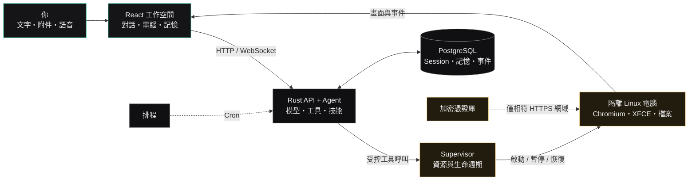
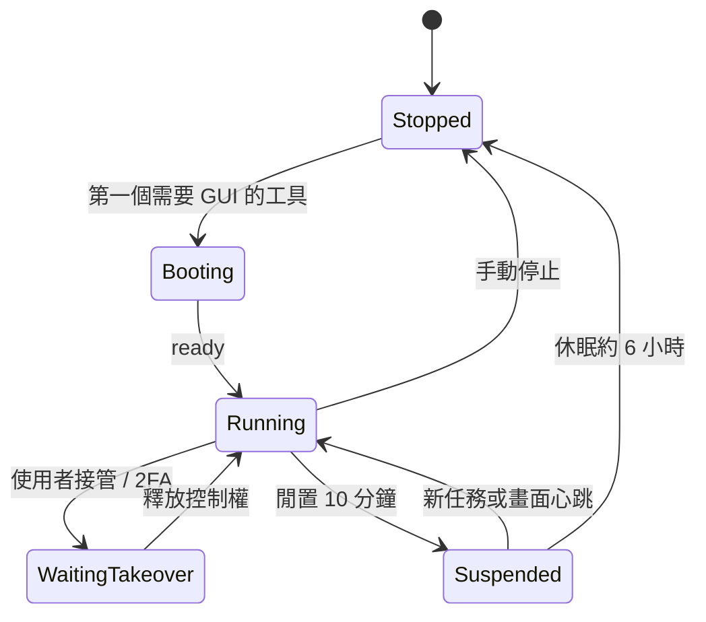

# 架構與流程

[← 回到 README](../README.zh-TW.md)

## 一個任務如何完成



<div align="center">

**[開啟可縮放、可搜尋、支援深色模式的互動流程圖 →](./workflow.html)**

</div>

主流程之外還有兩個重要迴圈：

1. **接管迴圈**：使用者接管時，進行中的 run 進入等待；釋放後從目前畫面重新排隊執行。
2. **技能迴圈**：示範期間記錄控制項與頁面情境，模型整理成 playbook；往後仍在當下畫面重新尋找元素，不重播舊座標。

## 系統架構

LazyBoy 的公開入口只有 API。Supervisor 位於 Compose 內部 control network，不直接對主機開埠；Agent 桌面也不掛載主機 Docker socket。

```text
Browser
  │  HTTP / WebSocket / authenticated screen proxy
  ▼
lazyboy-api (:3101)
  ├── React 靜態前端
  ├── Session / Run / Memory / Schedule / Vault
  ├── Model provider / MCP client
  └── PostgreSQL + pgvector
          │
          │ authenticated internal control API
          ▼
lazyboy-supervisor (:7091, internal only)
          │
          ├── provision / pause / resume / stop
          ├── CPU / memory / PID limits
          └── isolated computer containers
                  ├── Chromium + CDP
                  ├── XFCE + AT-SPI
                  ├── Xvfb + x11vnc + websockify
                  └── per-computer persisted home
```

### 主要元件

| 元件 | 職責 |
| --- | --- |
| `apps/web` | Vite + React 19 三欄工作空間、noVNC、語音與雙語 UI |
| `crates/api` | 對外 Axum API、Agent run、Session、排程、記憶、MCP、保險箱 |
| `crates/harness` | 模型供應商、憑證解析與語音契約 |
| `crates/supervisor` | Docker 電腦生命週期、隔離與資源上限 |
| `crates/control` | CDP、AT-SPI、X11 與畫面觀察操作 |
| `crates/controld` | 電腦容器內部的 localhost 控制服務 |
| `crates/contracts` | 跨 crate 的 Bot、Run、Computer、Voice 資料契約 |
| `PostgreSQL` | 對話、run、記憶、排程、憑證與保留政策 |

### 電腦生命週期

下圖保留原本的操作流程視角；`WaitingTakeover` 表示控制權交接期間的等待情境，並非獨立的電腦資料庫狀態。


